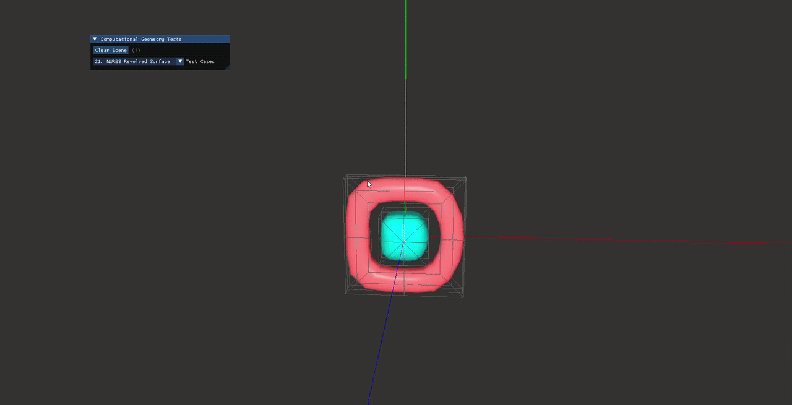

# ComputationalGeometryView

> **Computational Geometry and Computer Graphics Visualization Demonstration Project**

<div style="text-align: center;">
  <!-- Replace with your actual image path -->
  
</div>

## 📖 Introduction

This project implements the modeling and visualization of various curves and surfaces in Computational Geometry (CG) and Computer-Aided Geometric Design (CAGD). The project mainly consists of two core modules:

*   **Geometry Module**: Based on the **Eigen** library, focusing on geometric modeling. It covers core algorithms such as Cubic Spline, Cardinal Spline, Bezier Curve/Surface, B-Spline Curve/Surface, NURBS Curve/Surface, etc.
*   **Renderer Module**: Based on **OpenGL**, focusing on rendering geometric data. Supports the drawing of coordinate axes, curves, surfaces, and control meshes. It includes a Phong lighting model based on normal vector smoothing.

You can use this project as a complete application to gain a deeper understanding of computational geometry algorithms and computer graphics principles, or integrate the `geometry` or `renderer` modules into your own project to utilize their geometric modeling or rendering capabilities.

## ✨ Features

### 1. Curves Modeling

Supports the generation and discretization of multiple parametric curves:

*   **Interpolation Splines**: Cubic Spline, Cardinal Curve (supporting tension adjustment).
*   **Bezier Curves**: Cubic Bezier, Composite Bezier, Rational Quadratic Bezier, Degree Elevated Bezier.
*   **B-Spline Curves**:
    *   Uniform / Quasi-Uniform / Non-Uniform B-Spline.
    *   **Knot Insertion**: Demonstrates the Boehm algorithm to refine control polygons while maintaining the geometric shape.
*   **NURBS**: Modeling of general NURBS curves and accurate representation of circles/arcs based on NURBS curves.

### 2. Surfaces Modeling

Surface generation based on **Tensor Product** and other methods:

*   **Bezier Surfaces**: Cubic Bezier Patch, Composite Bezier Surface, Rational Bezier Patch (Biquadratic, 2x1).
*   **B-Spline Surfaces**: Cubic Uniform B-Spline Patch, Non-Uniform B-Spline Surface.
*   **NURBS Surfaces**: General NURBS surfaces, Revolved NURBS  Surfaces.

### 3. Rendering and Interaction

*   **3D Roaming**: FPS-style camera, supporting movement with keyboard and mouse look.
*   **Phong Lighting Model**: Phong lighting rendering based on normal vector smoothing (Spatial Welding).
*   **UI Interaction**: Integrated **ImGui**, supporting real-time switching between 20+ different geometric testing scenarios via a dropdown menu.
*   **Visual Aids**: Supports displaying control meshes, control polygons, and coordinate axes.

## 🛠️ Dependencies

This project is developed based on the C++17 standard and built using CMake.

*   **Core Language**: C++17
*   **Build System**: CMake (>= 3.25)
*   **Graphics API**: OpenGL 3.3 Core Profile
*   **Third-party Libraries**:
    *   [Eigen3](https://eigen.tuxfamily.org/): Linear Algebra and Geometric Computation.
    *   [GLFW](https://www.glfw.org/): Window management and input processing.
    *   [GLAD](https://glad.dav1d.de/): OpenGL function loading.
    *   [glm](https://github.com/g-truc/glm): Graphics Mathematics Library.
    *   [ImGui](https://github.com/ocornut/imgui): Immediate Mode GUI library.

## 🚀 Build

We recommend using `vcpkg` to manage dependencies.

### Prerequisites

1.  Install a C++ compiler (MSVC or GCC/Clang recommended).
2.  Install [CMake](https://cmake.org/).
3.  Install [vcpkg](https://github.com/microsoft/vcpkg) and the required packages:
    ```bash
    vcpkg install glfw3 glad glm eigen3 imgui
    ```

### Compilation Steps

You can use `CMakePresets.json` (ensure `toolchainFile` points to your vcpkg installation) or standard CMake commands.

```bash
# 1. Clone repository
git clone https://github.com/Azrcnb/computational-geometry-view.git
cd computational-geometry-view

# 2. Configure (Replace <path-to-vcpkg> with your actual vcpkg path)
cmake -B build -S . -DCMAKE_TOOLCHAIN_FILE=<path-to-vcpkg>/scripts/buildsystems/vcpkg.cmake

# 3. Compile
cmake --build build --config Release
```
## 📂 Structure

```text
project-root/
├── src/
│   ├── Application.h/cpp       # Application main loop, window, and input callbacks
│   ├── main.cpp                # entry function, defines all test cases
│   ├── geometry/               # [Core] Geometric modeling algorithm implementation
│   │   ├── curves/             # curve classes
│   │   └── surfaces/           # surface classes
│   ├── renderer/               # [Core] Geometric renderer based on OpenGL
│   │   ├── GeometryRenderer.h  # VAO/VBO management and drawing calls
│   │   ├── Camera.h            # Camera class
│   │   └── Shader/             # shader loading
│   └── testdata/               # Test data generation functions
├── assets/
│   └── Shader/                 # GLSL Vertex and Fragment Shader
├── CMakeLists.txt              # CMake Build Script
└── CMakePresets.json           # CMake Preset Configuration
```
---
# ComputationalGeometryView

> **计算几何与计算机图形学可视化演示项目**

## 📖 项目简介

这个项目实现了计算几何（Computer Aided Geometric Design, CAGD）中各类曲线与曲面的建模与可视化。项目主要包含两个核心模块：

*   **Geometry 模块**：基于 **Eigen** 库实现，专注于几何建模。涵盖了三次样条、Cardinal 样条、贝塞尔（Bezier）曲线/曲面、B样条（B-Spline）曲线/曲面、NURBS 曲线/曲面等核心算法。
*   **Renderer 模块**：基于 **OpenGL** 实现，专注于几何数据的渲染。支持坐标轴、曲线、曲面、控制网格的绘制，并包含基于法向量平滑的 Phong 光照模型。

您可以将本项目作为一个完整的应用程序来深入理解计算几何算法与计算机图形学原理，也可以单独剥离 `geometry` 或 `renderer` 模块集成到您自己的项目中以利用它们的几何建模和渲染能力。

<div style="text-align: center;">
  <!-- Replace with your actual image path -->
  
</div>

## 功能特性 (Features)

*   **几何建模 (`geometry` 模块)**:
    *   基于 [Eigen](https://eigen.tuxfamily.org/) 库实现。
    *   支持多种经典曲线类型：
        *   三次参数样条 (Cubic Spline)
        *   Cardinal 样条 (Cardinal Spline)
        *   贝塞尔曲线 (Cubic Bezier Curve, Composite Bezier Curve)
        *   B样条曲线 (Uniform/Quasi-Uniform/Non-Uniform B-Spline Curve)
        *   NURBS 曲线 (NURBS Curve)
        *   NURBS 圆弧近似 (NURBS Circle Approximation)
    *   支持多种曲面类型：
        *   贝塞尔曲面 (Cubic Bezier Patch, Composite Bezier Surface)
        *   有理贝塞尔曲面 (Rational Biquadratic Bezier Patch, Rational Bezier Patch 2x1)
        *   B样条曲面 (Cubic Uniform B-Spline Patch, Non-Uniform B-Spline Surface)
        *   NURBS 曲面 (NURBS Surface, NURBS Revolved Surface)
    *   包含几何操作，如 B样条节点插入 (Knot Insertion)。
*   **实时渲染 (`renderer` 模块)**:
    *   基于 [OpenGL](https://www.opengl.org/) 实现。
    *   渲染核心几何元素：坐标轴、曲线、曲面、控制网格。
    *   集成 [Phong 光照模型](https://en.wikipedia.org/wiki/Phong_shading) 以增强视觉效果。
    *   包含交互式相机控制（平移、旋转、缩放）。
    *   使用 [ImGui](https://github.com/ocornut/imgui)，支持通过下拉菜单切换 20+ 种不同的几何测试场景。

## 🛠️ 依赖项 (Dependencies)

*   [Eigen3](https://eigen.tuxfamily.org/)
*   [GLFW](https://www.glfw.org/)
*   [GLM](https://github.com/g-truc/glm)
*   [GLAD](https://glad.dav1d.de/)
*   [ImGui](https://github.com/ocornut/imgui)

## 🚀 构建指南

本项目推荐使用 `vcpkg` 管理依赖。

### 前置准备
1.  安装 C++ 编译器（推荐 MSVC 或 GCC/Clang）。
2.  安装 [CMake](https://cmake.org/)。
3.  安装 [vcpkg](https://github.com/microsoft/vcpkg) 并安装所需依赖：
    ```bash
    vcpkg install glfw3 glad glm eigen3 imgui
    ```

### 编译步骤

您可以使用项目根目录下的 `CMakePresets.json`（**注意：需根据您的环境修改 `vcpkg.exe和cmake.exe` 的路径**），或者使用标准的 CMake 命令。

```bash
# 1. 克隆仓库
git clone https://github.com/Azrcnb/computational-geometry-view.git
cd computational-geometry-view

# 2. 配置 (请将 <path-to-vcpkg> 替换为您的 vcpkg 实际安装路径)
cmake -B build -S . -DCMAKE_TOOLCHAIN_FILE=<path-to-vcpkg>/scripts/buildsystems/vcpkg.cmake

# 3. 编译
cmake --build build --config Release
 ```
 
 ## 📂 项目结构

```text
├── src/
│   ├── Application.h/cpp       # 应用程序主循环、窗口与输入回调
│   ├── main.cpp                # 入口函数，定义了所有测试用例 (Test Cases)
│   ├── geometry/               # 【核心】几何算法实现
│   │   ├── curves/             # 曲线类
│   │   └── surfaces/           # 曲面类
│   ├── renderer/               # 【核心】OpenGL 渲染器
│   │   ├── GeometryRenderer.h  # 负责 VAO/VBO 管理与绘制调用
│   │   ├── Camera.h            # 摄像机类
│   │   └── Shader/             # 着色器加载
│   └── testdata/               # 测试数据生成函数
├── assets/
│   └── Shader/                 # GLSL 顶点与片元着色器
├── CMakeLists.txt              # CMake 构建脚本
└── CMakePresets.json           # CMake 预设配置
```


